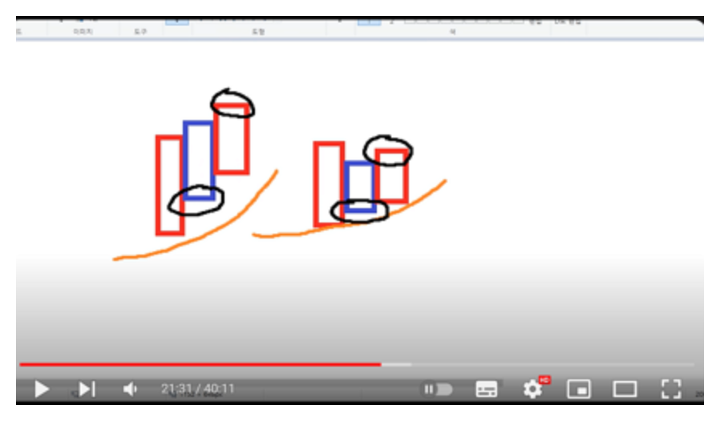
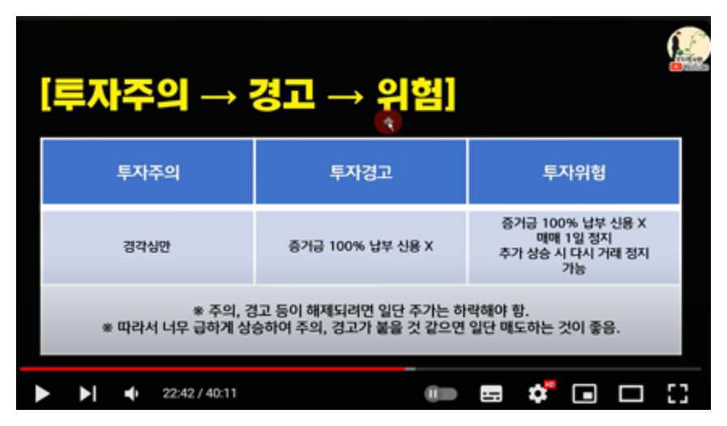

# 출처

- [부자회사원 유튜브 - 남석관,손실없는 투자원칙](https://www.youtube.com/watch?v=UY8HyBcB8eA)
- [손실없는 투자 원칙](https://product.kyobobook.co.kr/detail/S000210697473)

 

# 수익이 날 만한 종목을 찾는 세 가지 방법

수익이 날 만한 종목을 찾는 세 가지 방법

1\) 움직이는 종목에서 찾는다.

- 평소보다 거래량이 많고 주가가 상승한 종목을 대상으로 한다.
- 이런 종목은 당시 이슈나 호재로 투자자가 관심을 갖고 매수했다는 의미다.

2\) 시장 중심 이슈에 해당하는 종목에서 찾는다.

- 주가를 끌어올릴 뉴스, 이슈를 탈 만한 종목에서 찾는다.
- e.g. 실적양호, 공급체결, 글로벌 기업과의 제휴 등 

3\) 단기차트(기술적분석)를 참고해 찾는다.

- 단기매매, 횡보장에서는 이동평균선을 보고 매매판단을 내리는 것이 중요하다.
- 하락을 멈추고 이평선 60일,120일선에서 횡보하는 종목에 관심을 갖는다.
- 20 ~ 30% 정도 1차 상승을 했지만 하락해서 
  10일선,20일선을 지지하며 다시 반등하는 종목도 관심권에 둔다.

 

# 19. 대 시세를 내는 종목의 초기 매수

시장 전체의 분위기가 우호적인날

- 횡보하다가 장대양봉을 처음 세우는 종목이 눈에 띄면 무조건 매수한다.
- 이런 종목의 상승 대부분은 공개되지 않은 정보를 접한 사람들이
매수했기 때문이다.

 

무조건 매수에는 몇 가지 조건이 붙는다.

- 첫째, 당일 10% 상승 전후에는 매수한다.
- 둘째, 등락률 15% 이상인 경우는 신중해야 한다.
- 셋째, 20% 이상 상승 2시 이후 상한가를 기록하지 못했다면
미련없이 무조건 매도한다.

 

정리하면 다음과 같다.

1) 10% 전후 상승해도 매수한다.
2) 뉴스와 호재가 강력하면 상한가까지 기다린다.
3) 상한가에 닿지 못하면 상황을 살펴 되도록 고점에서 매도한다.

# 7. 10% 전후 종목 매수시 유의 사항
무조건 매수시 알아둬야 할 것이 있다.

- 바로 **"계좌의 10 ~ 20% 정도만 매수하는 것"** 이다. 
- 만약 주가가 매수한 이후 추가로 상승하면 추격매수에 나선다.

 

가격이 떨어질 때 매수하지는 않는다. 주가가 계속 오를때만 매수한다.

- 여기서 주의할 점은 가격이 떨어질 때 매수해선 안된다는 것이다.
- 추격 매수의 전제 조건은 주가가 계속 오르는 경우로 한정한다.

 

추격매수는 주가가 20% 이상 오르면 멈추는 것이 좋다.

- 즉 주가가 20% 이상 상승하기 전 까지 추가매수를 마무리해야 한다는 것이다.
- 이렇게 매수를 마친 종목은 상한가를 가는지, 못가는지를 지켜본다.

 

횡보하다가 장대양봉을 세운 종목은 관찰하면서 투자 기회를 노리자.

- 횡보하다가 장대양봉을 세운 종목은 관찰하면서 투자 기회를 노린다.
- 며칠 후 차트가 아래에서 정배열 진행 된다.
- 참고로 주가가 오랫동안 횡보하다가 처음 장대양봉을 세운 종목은 대부분 며칠 후 차트가 아래에서 정배열 되며 상승하곤 한다.

 

# 9. N형 패턴 (횡보장)

- 주가가 횡보하다가 처음 대체로 20% 이상 상승했는데, 이후 3\~7 거래일 이후 하락하여 원래 가격까지 매수한다.
- 지수가 하락하거나 상승하는 장에서는 자주 나타나지 않고 횡보하는 상황에서 자주 출몰하는 패턴이다.

- 매수에 거의 부담이 없다고 보면 된다. 

- 주가가 횡보하다 호재성 뉴스로 급등하는 종목이 대상이다.

- 대량 거래량 이후 3 ~ 7 일간 하락해서 이격이 줄고 
  5일 이평선  또는 10일 이평선을 지지할 때 매수한다.

- 이때 주의할 점은 호재성 뉴스가 소멸되지 않아야 한다.

 

# 10. 양음양 매수매도 타점 (시장이 좋을 때)

- 양음양 패턴은 **이슈나 호재성 뉴스가 지속되는 종목 군**에서 자주 나타난다.
- N형패턴은 횡보장에서 자주 나타나지만
- **양음양 패턴은 시장이 좋을때** 많이 나타난다.
- 이격이 높지 않은 상태를 의미하는데 가격이 많이 떠 있지 않은 상태에서
  5일,10일 선이 지지하는 가운데
  어제 상승, 오늘 하락, 내일 상승하는 패턴이다.
- 이 때 중간 음봉은 이평선 위에 위치하고 있어야 한다.

 

# 8. 단기투자에서 중기투자로

- 처음에는 단기투자로 대응했지만 시간이 지나면서 중장기로 상승하는 종목들이 제법 있다.

상승 10% 대에서 매수한 종목이 상한가를 가면, 장초반 매도하지 말고 당일 최고가 꼭지 확인후 매도를 한다.

- 특히 상승 10% 대에서 매수한 종목이 상한가를 갔다면
  이튿날 장 초반에 매도하지 말고 "반드시"!!! 당일 최고가 꼭지를 확인한 후에
  매도하는 것이 좋다. 이것이 단기 투자에서 수익을 극대화 하는 방법이다.

- 뉴스와 호재가 강력하다면 다음 날에도 20% 이상 상승한다.

- 2020년, 2021년 코로나 시기에 첫 상한가 종목이 연속해서
  상한가까지 가거나 계속 상승하는 사례가 많았다.

상한가 간 종목의 그 이후 타점은 5일선

- 만약 상한가 간 종목이 있다면 그 이후 노려야할 자리는 5일선 자리다.
  3~5일 정도 지나면 이때 대부분 다시 한번 재상승하는 모습을 보여준다.

- 그러니까 주가가 5일선에 닿을 것이라고 예상하고
  그 생각이 실제로 현실화되면 매수하는 것이다. 
  그리고 이후 상승하면 매도하는 것 이다.

- 이때 주의점은 당일 오후장에 이르러 상승폭이 둔화하거나
  하락 전환할 때 매수하면 절대 안된다는 것이다.

- 참고) 중요!! 개별주는 5일선 닿고 재반등 후 5일선 깨진다.
  개별 단기 투자에서 대부분 5일선에 닿고 재반등이 발생하는데
  이후에는 무조건 5일선이 깨진다.

 

# 15\. 중장기 투자 매매 타점 (5,10일선에서 10~20% 초기 매수)

- 바닥 대비 3배 \~ 5배 상승하는 시가총액이 큰 주식들은
   골든크로스를 형성한 뒤 이평선이 정배열 되는 모습을 보인다.
- 바닥에서 30~50% 상승한 종목이 시대중심주라고 판단되면
  단기적으로 5일선 또는 10일선에 왔을때
  전체 투자금의 10~20%를 매수해본다. 
- 이 때 투자금의 '일부'만 넣어야 한다.
- 그리고 가격이 5일선을 타고 다시 오르면 투자금의 비중을
  올리는 방식으로 매수를 해나간다.
- 시대중심주, 시장중심주라는 판단이 서면
  5일선, 10일선에서 어느 정도는 확신을 가지고 매수하라는 이야기
- 대시세를 주는 종목은 '반드시' 5일선,10일선에서 매수할 기회를 준다.

 

# 16\. 시대 중심주가 아닌 종목 분별법 - 10일선,20일선

- 10일선, 20일선을 깨면서 하락하면 시대 중심주가 '절대로' 아니다.

- 만약 시대중심주라고 판단해 매수했더라도 20일선을 깨고 하락하면
  잘못을 인정하고 매도하거나 매수가 근처까지 가격이 상승할 때
  매도한다.

- 다시 한번 강조하지만 큰 시세를 내는 시대 중심주는
  왠만해서는 20일선까지 내려가지 않는다.

 

# 17\. 중장기투자 매도 타점

- 지수가 회복세를 보이면서 내가 보유한 종목이 정배열 우상향 중일때
  차트 상으로 꼭지가 될때를 잘 포착해야 한다.
- 꼭지는 **'데드크로스가 발생할때'** 를 의미한다.
- 불안하다면 **물량의 20\~30% 를 익절** 후 **이평선 데드크로스 시 전량매도**하는 것도 좋다.
- 간단해보이지만 이 방법이 중장기 투자에서 큰 수익을 내는 환상적인 배도기술이다.
- 저자가 계속 반복해서 강조하는 말은 '고점(꼭지)를 확인한 후 팔아라'

 

# 18\. 중장기 투자가 능사는 아니다.

- 변동성이 적고 안정적으로 우상향하는 종목을 물어보는 사람이 많은데
  여기에 대해서는 항상 아래와 같이 답했다.
  **"시장 변동상황에 대응하는 것이 최선입니다"**

- 실시간으로 대응이 힘든 직장인은 적립식으로 투자해 수익이 나는 종목을
  바라기도 한다. 정보가 제한적인 시절에는 우아한 투자가 가능했다.

- 하지만 최신 정보가 실시간으로 유통되는 현대에는 우아한 투자가 
  쉽지 않다. 중장기 투자를 선호하는 투자자라도 변화에 따라
  단기 대응을 할줄 알아야 자산을 잃지 않고 키워갈 수 있다.

- 중장기투자가 정답,능사는 아니라는 말을 하고 싶다.

  

# 19\. 대시세를 내는 종목의 초기 매수

- 주가가 횡보하다가 30% 상승하면서 양봉을 세우면 크게 상승했더라도
  일단 매수하고 지켜본다.

- 왜냐하면 대시세를 내는 종목은 대부분 '패턴'을 가지고 움직이기 때문이다.

- 저자는 이런 흐름이 반복되었다는 것을 경험을 자주해보면서 
  직관적인 감각으로 알고 있다.

- 여기서 중요한 것은 주가가 기술적으로 횡보하다가 10%이상 상승한 장대양봉을 만들면
  '차트는 정배열로 펼쳐질 준비를 한다는 것' 이다.

- 수익을 내는 단기투자자 대부분이 이 방법을 활용한다. 
  최초 10% 장대 양봉에서 매수하고 처음 5일 선에 닿으면 전체 투자액 중 20% 를 매수한다.

- 그 이후 5일선, 10일선이 깨지지 않고 추가 상승하면 추격매수에 나선다.

- 대 시세를 내는 종목은 100% 이상 상승할 때 까지 10일선 아래로 내려오는 일이 거의 없다.

 

# 11. 투자경고, 투자위험, 단기과열 종목 대처법

- 투자 주의 경고
  5거래일 상승율이 45~60% 이상될 때 '투자 주의 경고'

- 투자 경고
  그 이후 주가가 더 오르면 '투자경고'

- 투자 위험
  '투자 경고'를 받았음에도 상승이 지속되면 '투자위험종목'

 

# 12\. 단기투자에서 중요한 것들

- 단기 투자 시 매수 후 주가가 상승하면 많은 투자자들은 행복감에 젖어든다.
- 하지만 단기투자시에는 항상 신속하게 매도하겠다는 생각을 가져야 한다.
- 장초반 갭 상승 또는 이격이 높게 상승하면 일단 보유 종목의 50% 정도는 반드시 익절해야 한다.
- 전일 상한가 간 종목이 다음날 시초가가 낮은 상승세를 보인다면 시초가에 시장가로 매도하는 것이 맞다.

 

# 13\. 미련을 갖지 마라

- 급등하는 종목을 매수하지 못했거나 낮은 가격에 일찍 매도했던 경험, 매도 후 주가가 크게 오를 때
- 이럴 때 아쉬움을 갖게 된다.
- 그러나 시장은 매일 열리고 기회 또한 반복해서 찾아온다. 그러니 미련을 가질 필요가 없다.

 

# 20\. 마이너스 5% 손절원칙 지키기

- '손절' 은 실천하기 쉽지 않다.

- 부자가 되겠다는 꿈으로 주식투자를 시작했는데 큰 손해를 보고 매도하려면
  마음이 아리고 정신적 충격도 클 수 밖에 없다.

- 하지만 마음을 다시 추스리고 냉정함을 유지해야 한다. 
  재기불능의 상황으로 내몰리면 절대 안된다.

- 저자는 되도록 -3% 가 되면 일단 매도한다.
  떨어진 주가가 다시 올라갈 거라고 예상되더라도 일단 손절하고 
  재매수하는 투자전략을 쓴지 오래되었다.

- 일반적으로 -5% 손절율을 정해두고 지키기를 권한다.

- -5%에 매도했는데 -10% 까지 떨어졌다가 급등세로 전환했다고
  절대 아쉬워하면 안된다. 

- 작은 실패를 교정해 자신만의 투자 방법으로 만들면 평생 돈 벌어 성공하는 
  주식 투자자로 살 수 있다. 작은 손절을 절대 두려워하면 안된다.

- 예컨대 -5% 손절을 세 차례 경험한 상황이라면 일단 신규매수를 멈추자.
  그리고 무엇이 잘못되었는지 스스로 분석하고 되돌아보는 시간을 가져야 한다.
  -5% 손절을 다섯차례 반복한 투자자라면 기초부터 다시 공부해야 한다.